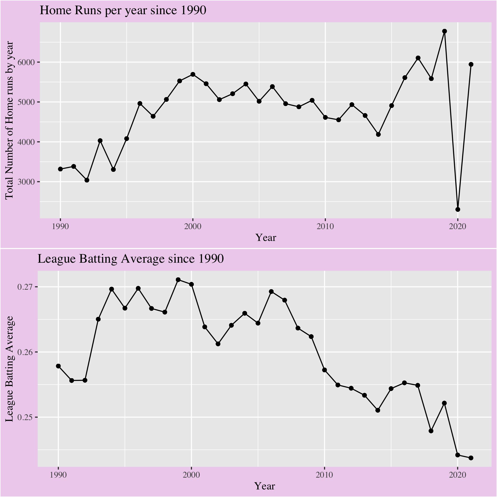

```{r setup, include=FALSE}
knitr::opts_chunk$set(echo = TRUE)
```

```{r, include = FALSE}
library(tidyverse)     # for data cleaning and plotting
library(gardenR)       # for Lisa's garden data
library(lubridate)     # for date manipulation
library(openintro)     # for the abbr2state() function
library(patchwork)     # for nicely combining ggplot2 graphs  
library(gt)            # for creating nice tables
library(rvest)         # for scraping data
library(robotstxt)     # for checking if you can scrape data
library(janitor)       # for cleaning names
library(baseballr)
library(sportyR)
# library(pitchRx)
# library(Lahman)


somedata <- read_csv("https://raw.githubusercontent.com/aleidner6/FinalProject/main/baseballfinalproject.csv")

alonsodata <- read_csv("https://raw.githubusercontent.com/aleidner6/FinalProject/main/alonsodata1.csv") 

homerundata <- read_csv("https://raw.githubusercontent.com/aleidner6/FinalProject/main/stats%20(3).csv")

baseballdata <- read_csv("https://raw.githubusercontent.com/aleidner6/FinalProject/main/stats%20(4).csv")

#preliminary baseball data of hitters from 2015-2022 season. Some important stats to note are woba, xwoba, EV, and LA. If you want to look at other/more stats or for specific players go for it!
```

Introduction and Background: An introduction that motivates & outlines a clear, specific set of research questions. Also, provide some background on your topic.


I'm trying to think of what set of research questions we want to look at? Individual people comparisons?  

Suggestions for how to become a more successful hitter? What makes a hitter a "good" hitter? Do we want to create our own metrics? functions?

Two questions/problems I've run into. 
1. Are we able to look at every single ball put into play in a given year? 
2. if we are able to acquire that data, how would we put that into a spray chart? is there data containing x, y values?

Data collection: Specification of your data sources and collection process.

We found our data from the website, Baseball Savant and used their selection tools to select the statistics that we wanted. From there we either 

Analysis: This is the bulk of the report which either has a presentation of the group’s key findings and take-aways or gives the detail of how someone would interact and what people should take away from the shiny app. If you choose to do a shiny app, be sure to include a link to the shinyapps.io site.


```{r}
alonsodata %>%
  # filter(`Result` == c("single", "double", "triple", "home_run")
  # ) %>%
  #filter(Result == "home_run") %>%
  ggplot(aes(x = `LA (°)`, 
             y = `EV (MPH)`, 
             color = `Result`)) +
  geom_point() +
  labs(title = "Home Run launch angle vs exit velocity", 
       x = "Launch Angle", 
       y = "Exit Velocity")
```

```{r}
geom_baseball(league = "MLB")

```

```{r}
baseballdata %>%
  group_by(year) %>%
  #filter(year == "2021") %>%
  mutate(totavg = mean(batting_avg)) %>%
  mutate(avgobp = mean(on_base_percent)) %>%
  ggplot(aes(x = year, 
             y = avgobp)) +
  geom_line()


baseballdata %>%
  group_by(year) %>%
  #filter(year == "2021") %>%
  mutate(totavg = mean(batting_avg)) %>%
  mutate(avgobp = mean(on_base_percent)) %>%
  ggplot(aes(x = year, 
             y = totavg)) +
  geom_line()

```

```{r}
# require(gridExtra)
# 
# TeamStats <- read_csv("/Users/annaleidner/Desktop/Data Science/FinalProject/Teams.csv")
# 
# hrabTeam <- TeamStats %>%
#   filter(yearID >= 1990 & lgID %in% c("AL", "NL")) %>%
#   select(yearID, lgID, teamID, franchID, divID, Rank, HR, AB, H, SO) %>%
#   group_by(yearID) %>%
#   mutate(teamBA = (H/AB)) %>%
#   mutate(totHR = sum(HR)) %>% #total home run each year
#   mutate(yearBA = mean(teamBA)) %>% #year batting average 
#   mutate(totalK = sum(SO))
# 
# #par(mfrow=c(1,2)) 
# 
# plot1 <- hrabTeam %>%
#   ggplot(aes(x = yearID, y = totHR)) + #, type = "1", col = 2
#   geom_line() +
#   geom_point() +
#   labs(title = "Home Runs per year since 1990", 
#        y = "Total Number of Home runs by year",
#        x = "Year") +
#   theme(plot.background = element_rect(fill = "thistle2"),
#         text = element_text(family = "Times"))
# 
# #par(new = TRUE)
# 
# plot2 <- hrabTeam %>%
#   ggplot(aes(x = yearID, y = yearBA)) +
#    # ggplot(aes(x = yearID, y = yearBA, type = "1", col = 3, axes = FALSE, xlab = "", ylab = ""))
#   geom_line() +
#   geom_point() +
#   labs(title = "League Batting Average since 1990", 
#        y = "League Batting Average",
#        x = "Year") +
#   theme(plot.background = element_rect(fill = "thistle2"),
#         text = element_text(family = "Times"))
# 
# #grid.arrange(plot1, plot2, ncol = 2)
# ggsave("baseball.png", arrangeGrob(plot1, plot2))
```
# ```{r, echo=FALSE}
# 
# ```
